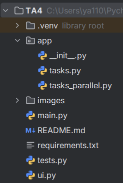
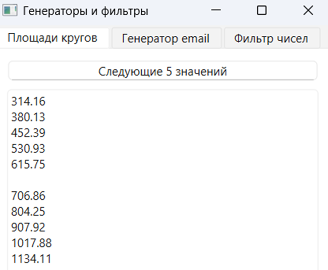
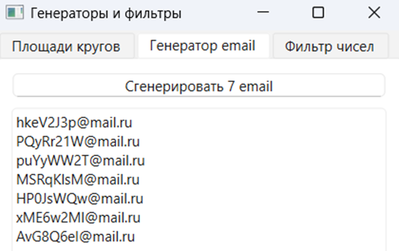
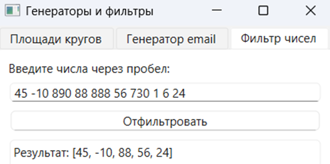

# Функции-генераторы и работа со внутренними функциями python
## Функциональность
* Задача 1. Позволяет получить значение площади круга.
* Задача 2. Позволяет получить случайные значения email-адресов.
* Задача 3. Позволяет отобрать только двузначные числа из строки.

## Технологии
* Python >=3.10, <3.14
* PyTest
* PySide6

## Установка и запуск
### Обычный:
`pip install -r requirements.txt
python main.py`
### Сравнение эффективности:
`python tasks_parallel`
### Тесты:
`python -m pytest tests.py -v`

## Особенности
Модульная структура с пакетом из 2 модулей, демонстрация встроенных функций Python, интерфейс на PySide6, покрытие тестами PyTest

## Архитектура

## Использование
После запуска доступна главная форма, содержащая меню сверху:
1. Площади кругов (задача 1)
2. Генератор email (задача 2)
3. Фильтр чисел (задача 3)

#### Площади кругов (задача 1)

Нажмите кнопку для отображения

#### Генератор email (задача 2)

Нажмите кнопку для отображения

#### Фильтр чисел (задача 3)

1. Введите числа через пробел
2. Нажмите кнопку для отображения

